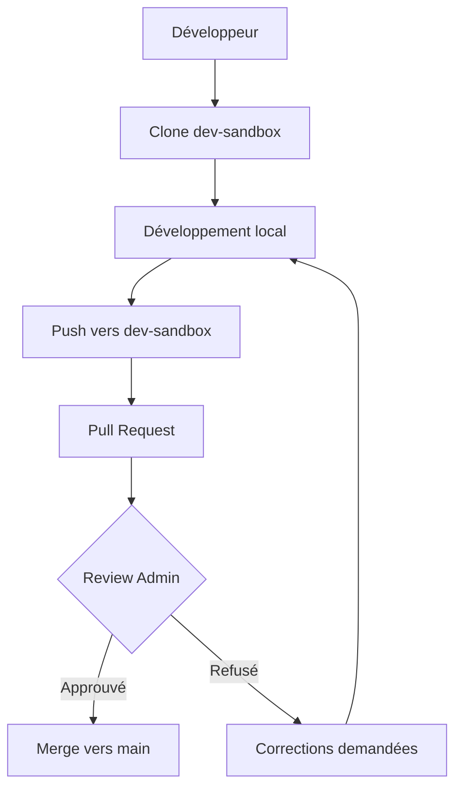

# 🔒 Guide de Sécurisation GitHub - Projet MED-MNG

## 🎯 Objectif
Créer un environnement de développement sécurisé où le développeur peut travailler en autonomie sans jamais accéder à la branche principale ou aux éléments sensibles.

---

## 📋 Checklist de Sécurisation

### ✅ 1. Créer la branche dev-sandbox

```bash
# Sur GitHub, dans votre dépôt MED-MNG :
git checkout main
git pull origin main
git checkout -b dev-sandbox
git push origin dev-sandbox
```

**Ou via l'interface GitHub :**
1. Aller sur votre dépôt GitHub MED-MNG
2. Cliquer sur le sélecteur de branche (main)
3. Taper "dev-sandbox" et cliquer "Create branch"

---

### ✅ 2. Protéger la branche main

**Dans GitHub :**
1. Aller dans `Settings` > `Branches`
2. Cliquer `Add rule`
3. Branch name pattern : `main`
4. Activer :
   - ☑️ `Require pull request before merging`
   - ☑️ `Require approvals before merging` (minimum 1)
   - ☑️ `Restrict pushes that create files`
   - ☑️ `Restrict who can push to matching branches`
   - ☑️ `Include administrators`
   - ☑️ `Allow force pushes` → **DÉSACTIVER**
   - ☑️ `Allow deletions` → **DÉSACTIVER**

---

### ✅ 3. Configurer les permissions utilisateur

**Inviter le développeur :**
1. `Settings` > `Manage access`
2. `Invite a collaborator`
3. Rôle : `Write` (pas Admin)
4. Créer une règle de protection personnalisée pour limiter l'accès aux branches

**Restrictions pour le développeur :**
- ❌ Aucun accès à `Settings`
- ❌ Aucun accès aux `Secrets`
- ❌ Aucun accès aux `Actions` (CI/CD)
- ❌ Aucun accès à la branche `main`
- ✅ Accès uniquement à `dev-sandbox`

---

### ✅ 4. Nettoyer les secrets du code

**Fichiers à sécuriser :**
- `.github/workflows/auto-extract-uness.yml`
- `scripts/immediate-launch.js`
- `src/integrations/supabase/client.ts`

**Actions prises :**
- ✅ Création du fichier `.env.test` avec clés fictives
- ✅ Remplacement des clés hardcodées par des variables d'environnement
- ✅ Suppression des clés sensibles exposées

---

### ✅ 5. Configurer les GitHub Secrets

**Dans GitHub Settings > Secrets and variables > Actions :**

```
SUPABASE_URL=https://yaincoxihiqdksxgrsrk.supabase.co
SUPABASE_ANON_KEY=[votre clé anon réelle]
SUPABASE_SERVICE_ROLE_KEY=[votre clé service role réelle]
OPENAI_API_KEY=[votre clé OpenAI réelle]
SUNO_API_KEY=[votre clé Suno réelle]
STRIPE_SECRET_KEY=[votre clé Stripe réelle]
```

**⚠️ Important :** Le développeur n'aura JAMAIS accès à ces secrets.

---

## 🛡️ Contrôles de Sécurité

### Vérifications Automatiques

**Avant chaque push :**
- [ ] Aucune clé API réelle dans le code
- [ ] Utilisation des variables d'environnement
- [ ] Fichiers `.env*` dans `.gitignore`

**Contrôles périodiques :**
- [ ] Audit des permissions utilisateurs
- [ ] Vérification des branches actives
- [ ] Révision des pull requests

---

## 🚨 Signaux d'Alerte

**Surveiller :**
- Tentatives d'accès à la branche `main`
- Modifications non autorisées des `Settings`
- Ajout de nouveaux collaborateurs
- Push direct vers `main` (normalement bloqué)

---

## 🔄 Workflow de Développement Sécurisé



---

## 📞 Support et Escalade

**En cas de problème :**
1. Vérifier les logs GitHub Actions
2. Consulter les permissions utilisateur
3. Vérifier l'intégrité des secrets
4. Contacter l'administrateur si nécessaire

---

## ✅ Validation Finale

- [ ] Branche `dev-sandbox` créée
- [ ] Branche `main` protégée
- [ ] Permissions utilisateur configurées
- [ ] Secrets GitHub configurés
- [ ] Code nettoyé des clés sensibles
- [ ] Fichier `.env.test` créé
- [ ] Développeur invité avec restrictions

**🎉 Environnement sécurisé prêt !**