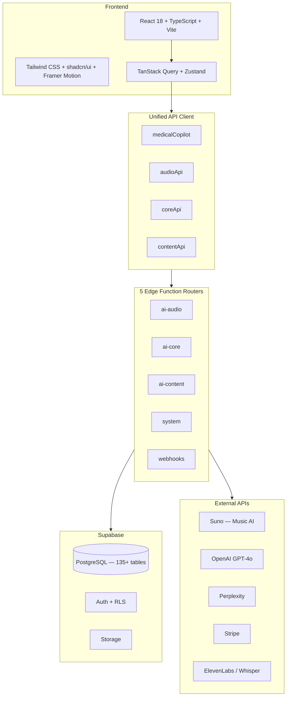

# MED-MNG — Plateforme d'Apprentissage Médical

**Version 9.6.3 | Statut : MVP en consolidation**

[](https://github.com/laeticiamng/med-mng)
[](https://www.typescriptlang.org/)
[](https://react.dev/)
[](https://supabase.com/)
[](https://web.dev/progressive-web-apps/)

> Plateforme d'apprentissage médical — ECOS, cas cliniques, QCM adaptatifs.
> Conçue pour les étudiants en médecine préparant l'EDN et les ECOS.

---

## Modules

| Module | Description |
|--------|-------------|
| **Préparation ECOS** | Simulations cliniques avec timer 7 min, grilles UNESS, scénarios interactifs |
| **QCM adaptatifs** | Mode examen avec feedback animé, export PDF, répétition espacée (SRS) |
| **Cas cliniques IA** | Génération de cas cliniques par intelligence artificielle, raisonnement structuré |
| **Drag-n-drop** | Réorganisation intuitive des items, flashcards et playlists via `@dnd-kit` |
| **Apprentissage musical** | Chansons pédagogiques générées par IA (Suno) — un item médical par chanson |
| **Medical AI Copilot** | Chat IA streaming avec sources académiques (GPT-4o, Perplexity) |
| **Items EDN complets** | 362+ items avec contenu enrichi, tableaux Rang A/B |
| **Flashcards** | Cartes 3D, raccourcis clavier, import Anki, SRS adaptatif |
| **Gamification** | XP, badges, streaks, leaderboard temps réel, défis quotidiens |

---

## Architecture



### Stack technique

| Catégorie | Technologies |
|-----------|-------------|
| **Framework** | React 18.3, TypeScript 5.0, Vite 5 (SWC) |
| **UI** | Tailwind CSS 3.4, shadcn/ui, Radix UI, Framer Motion 12 |
| **State** | TanStack Query 5, Zustand 5 |
| **Backend** | Supabase (PostgreSQL + Auth + 130+ Edge Functions) |
| **AI** | Suno V4.5, OpenAI GPT-4o, Perplexity, ElevenLabs, Whisper |
| **Payments** | Stripe (subscriptions) |
| **Testing** | Vitest, Playwright, Testing Library |
| **Forms** | React Hook Form + Zod |
| **Export** | jsPDF, xlsx |

---

## Démarrage rapide

### Prérequis

- Node.js 20+
- pnpm 8+ (recommandé) ou npm
- Git

### Installation

```bash
# Cloner le repository
git clone https://github.com/laeticiamng/med-mng.git
cd med-mng

# Installer les dépendances
pnpm install

# Configurer l'environnement
cp .env.example .env
# Éditer .env avec vos clés Supabase, OpenAI, Suno, etc.

# Lancer en développement
pnpm dev
# → http://localhost:8080
```

### Scripts utiles

```bash
pnpm build          # Build production
pnpm test           # Tests unitaires (Vitest)
pnpm lint           # ESLint
pnpm typecheck      # TypeScript --noEmit
pnpm test:ci        # Tests + typecheck
```

---

## Structure du projet

```
med-mng/
├── src/
│   ├── pages/              # 80+ pages (lazy-loaded)
│   ├── components/         # Composants organisés par domaine
│   │   ├── ui/             # Design system (shadcn/ui)
│   │   ├── ecos/           # ECOS (timer, grilles)
│   │   ├── edn/            # Items EDN
│   │   ├── music/          # Audio (UnifiedAudioPlayer)
│   │   ├── ai/             # Chat IA
│   │   └── ...
│   ├── hooks/              # 160+ hooks (domain-driven)
│   ├── lib/                # API clients, utilitaires
│   ├── config/             # Routes, navigation, env
│   └── services/           # Business logic
├── supabase/
│   ├── functions/          # 130+ Edge Functions
│   └── migrations/         # Migrations SQL
├── tests/                  # Tests E2E (Playwright)
└── docs/                   # Documentation technique
```

---

## Sécurité

| Mesure | Status |
|--------|--------|
| RLS sur toutes les tables | OK |
| Rate Limiting API | OK |
| SECURITY DEFINER functions | OK |
| HTTPS only | OK |
| Secrets en Edge Functions | OK |
| Admin role verification (server-side) | OK |

---

## Documentation

| Document | Description |
|----------|-------------|
| [ARCHITECTURE_PLATEFORME.md](./docs/ARCHITECTURE_PLATEFORME.md) | Architecture consolidée |
| [AUDIT_COMPLET_MODULES.md](./docs/AUDIT_COMPLET_MODULES.md) | Audit détaillé |
| [KNOWN_LIMITATIONS.md](./docs/KNOWN_LIMITATIONS.md) | Limites connues du MVP |

---

## Contribution

- TypeScript strict
- ESLint + Prettier
- Tests pour nouvelles features
- Tokens sémantiques CSS obligatoires (pas de couleurs hardcodées)

---

<p align="center">
  <strong>MED-MNG v9.6.3</strong><br>
  <em>EmotionsCare SASU</em>
</p>
