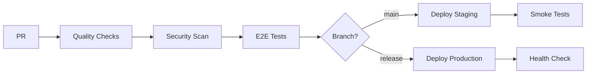

# 🚀 MedMng Platform - CI/CD Pipeline

[](https://github.com/username/medmng-platform/actions)
[](https://github.com/username/medmng-platform/actions)
[](https://github.com/username/medmng-platform/actions)
[](https://github.com/username/medmng-platform/actions)

## 🎯 Pipeline Overview

Notre pipeline CI/CD automatise complètement le cycle de développement :

### 📊 Quality Gates
- ✅ **Lint** - Code quality avec ESLint
- ✅ **Build** - Compilation TypeScript/React
- ✅ **Tests** - Tests unitaires et d'intégration
- ✅ **E2E** - Tests end-to-end avec Playwright
- ✅ **Security** - Scan Trivy + audit npm

### 🚀 Deployment Flow


### 🔒 Security Features
- 🛡️ **Vulnerability Scanning** avec Trivy
- 🔐 **Dependency Audit** automatisé
- 📊 **SARIF Reports** dans GitHub Security
- 🚫 **Branch Protection** - merge impossible si échec

### 📈 Monitoring & Alertes
- 📧 **Slack Notifications** pour deploy
- 📊 **Audit Reports** automatiques
- 💾 **Artifacts** conservés (tests, logs)
- 🏷️ **Tags Docker** versionnés

## 🛠️ Configuration Requise

### GitHub Secrets
```bash
# Staging Environment
STAGING_SUPABASE_URL=https://...
STAGING_SUPABASE_ANON_KEY=eyJ...

# Production Environment  
PROD_SUPABASE_URL=https://...
PROD_SUPABASE_ANON_KEY=eyJ...

# Notifications
SLACK_WEBHOOK_URL=https://hooks.slack.com/...
```

### Branch Protection Rules
```yaml
Required status checks:
  - quality-checks
  - security-scan  
  - e2e-tests
  
Restrictions:
  - Require pull request reviews: 1
  - Dismiss stale reviews: true
  - Require review from CODEOWNERS: true
```

## 🏃‍♂️ Quick Start

### 1. Connect GitHub Repository
```bash
# Dans Lovable
GitHub → Connect to GitHub → Create Repository
```

### 2. Configure Secrets
```bash
# GitHub Repository Settings → Secrets and Variables → Actions
# Ajouter tous les secrets listés ci-dessus
```

### 3. Enable Branch Protection
```bash
# Settings → Branches → Add rule for 'main'
# Cocher toutes les required status checks
```

### 4. First Push
```bash
git push origin main
# ✅ Pipeline démarre automatiquement
```

## 📋 Scripts Package.json

Ajoutez ces scripts pour la compatibilité pipeline :

```json
{
  "scripts": {
    "lint": "eslint . --ext .ts,.tsx,.js,.jsx",
    "lint:fix": "eslint . --ext .ts,.tsx,.js,.jsx --fix",
    "test": "vitest run",
    "test:watch": "vitest",
    "test:e2e": "playwright test",
    "test:e2e:ui": "playwright test --ui",
    "build": "vite build",
    "preview": "vite preview",
    "audit": "npm audit --audit-level=high",
    "security:scan": "trivy fs .",
    "docker:build": "docker build -t medmng-platform .",
    "docker:run": "docker run -p 3000:80 medmng-platform"
  }
}
```

## 🎭 Tests E2E Configurés

- 🔐 **Authentication flows** (login/logout)
- 🎵 **Music generation** (avec quotas)
- 💳 **Payment processing** (Stripe/PayPal)
- 📊 **Admin dashboards** (extraction/monitoring)
- 🔄 **Error handling** (network/API failures)

## 🚨 Troubleshooting Pipeline

### ❌ Build Fails
```bash
# Vérifier localement
npm run lint
npm run build
npm run test
```

### ❌ E2E Tests Fail  
```bash
# Debug en local
npm run test:e2e:ui
# Voir artifacts dans GitHub Actions
```

### ❌ Security Scan Issues
```bash
# Audit dependencies
npm audit
npm audit fix

# Scanner localement
trivy fs .
```

### ❌ Deployment Fails
```bash
# Vérifier secrets configurés
# Vérifier logs GitHub Actions
# Tester build Docker local
npm run docker:build
npm run docker:run
```

## 📊 Status Dashboard

- 🟢 **All Systems Operational**
- 🟡 **Partial Outage** 
- 🔴 **Major Outage**

[Live Status Page →](https://status.medmng.com)

## 🔄 Pipeline Updates

Le pipeline s'auto-met à jour via `.github/workflows/ci-cd.yml`. 

**Prochaines améliorations :**
- [ ] Cache npm/Docker layers
- [ ] Parallel job execution
- [ ] Performance budgets
- [ ] Automated rollbacks
- [ ] Blue/green deployments

---

**🎯 Objective : Zero-downtime deployments avec quality gates automatisés**