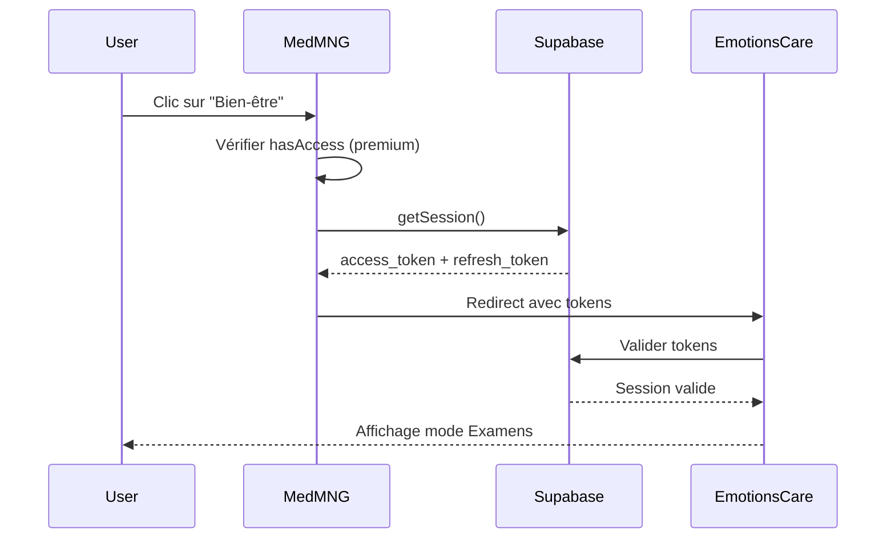

# Intégration EmotionsCare - SSO via Supabase

## 📋 Vue d'ensemble

Cette documentation décrit l'intégration du module **EmotionsCare** dans Med MNG, permettant aux étudiants avec un abonnement premium d'accéder à la plateforme de bien-être émotionnel EmotionsCare en mode "Examens" sans ressaisir leurs identifiants.

## 🎯 Objectifs

1. **Accès simplifié** : Les utilisateurs premium peuvent accéder à EmotionsCare en un clic depuis Med MNG
2. **SSO transparent** : Authentification automatique via les tokens Supabase partagés
3. **Contrôle d'accès** : Seuls les utilisateurs avec abonnement premium ont accès au module

## 🏗️ Architecture

### Composants créés

#### 1. Utilitaire SSO (`src/utils/emotionscare-sso.ts`)

Fonctions principales :
- `checkEmotionsCareAccess()` - Vérifie si l'utilisateur a accès au module
- `redirectToEmotionsCare()` - Effectue la redirection SSO avec les tokens
- `getEmotionsCareUrl()` - Construit l'URL de redirection (utile pour les tests)

```typescript
// Exemple d'utilisation
import { redirectToEmotionsCare } from '@/utils/emotionscare-sso';

await redirectToEmotionsCare();
// Redirige vers: https://app.emotionscare.com/exam-mode?access_token=...&refresh_token=...
```

#### 2. Hook React (`src/hooks/useEmotionsCareAccess.ts`)

Interface simplifiée pour les composants React :

```typescript
const { hasAccess, loading, navigateToEmotionsCare } = useEmotionsCareAccess();

// hasAccess: boolean - L'utilisateur a-t-il accès ?
// loading: boolean - Chargement en cours ?
// navigateToEmotionsCare: () => Promise<void> - Fonction de redirection
```

#### 3. Navigation (`src/components/layout/MainNavigation.tsx`)

Bouton "Bien-être" ajouté à la navigation principale :
- Visible uniquement pour les utilisateurs connectés avec plan premium
- Badge "Premium" pour identifier le module
- Icône cœur (Heart) pour représenter le bien-être
- Disponible sur desktop et mobile

## 🔐 Sécurité

### Gestion des tokens

**⚠️ Points de sécurité importants :**

1. **Pas de log des tokens** : Les tokens ne sont jamais écrits dans la console
2. **Transmission sécurisée** : Les tokens sont transmis via query parameters (considérer hash pour plus de sécurité en production)
3. **Session Supabase partagée** : Med MNG et EmotionsCare utilisent le même projet Supabase
4. **Vérification d'accès** : Double vérification côté Med MNG et (à implémenter) côté EmotionsCare

### Flux d'authentification



## 📊 Critères d'accès

Un utilisateur a accès à EmotionsCare si :

1. ✅ Il est **connecté** (session Supabase active)
2. ✅ Son plan d'abonnement contient "premium" (case-insensitive)

```typescript
// Vérification dans useEmotionsCareAccess
const isPremium = subscription?.plan_name?.toLowerCase().includes('premium') || false;
```

### Plans compatibles

- ✅ "Plan Premium"
- ✅ "Premium"
- ✅ "premium"
- ❌ "Plan Pro"
- ❌ "Plan Standard"
- ❌ "basic"

## 🎨 Interface utilisateur

### Bouton navigation (Desktop)

```tsx
{user && hasEmotionsCareAccess && (
  <button onClick={navigateToEmotionsCare}>
    <Heart /> Bien-être
    <Badge>Premium</Badge>
  </button>
)}
```

### Messages d'erreur

| Situation | Message |
|-----------|---------|
| Pas connecté | "Connexion requise - Veuillez vous connecter pour accéder au module bien-être" |
| Pas premium | "Le module bien-être EmotionsCare est inclus dans l'abonnement Réussite. Mets à jour ton abonnement pour y accéder." |
| Session expirée | "Session expirée - Veuillez vous reconnecter" |
| Erreur réseau | "Impossible d'accéder à EmotionsCare. Veuillez réessayer." |

## ⚙️ Configuration

### Variables d'environnement

Ajouter dans `.env` :

```bash
# EmotionsCare Integration (SSO)
VITE_EMOTIONSCARE_URL=https://app.emotionscare.com
```

**Environnements disponibles :**
- **Production** : `https://app.emotionscare.com`
- **Staging** : `https://staging.emotionscare.com`
- **Development** : `https://dev.emotionscare.com`

### Configuration Supabase

**Prérequis :**
- Med MNG et EmotionsCare doivent partager le **même projet Supabase**
- Même `SUPABASE_URL` : `https://yaincoxihiqdksxgrsrk.supabase.co`
- Même `SUPABASE_ANON_KEY`

## 🧪 Tests

### Test manuel

1. Se connecter à Med MNG avec un compte premium
2. Vérifier que le bouton "Bien-être" apparaît dans la navigation
3. Cliquer sur le bouton
4. Vérifier la redirection vers EmotionsCare en mode Examens
5. Vérifier que l'utilisateur est automatiquement connecté

### Test avec compte non-premium

1. Se connecter avec un compte Standard/Pro
2. Vérifier que le bouton "Bien-être" n'apparaît **pas**
3. Vérifier qu'aucune erreur console n'est affichée

### Test sans connexion

1. Se déconnecter de Med MNG
2. Vérifier que le bouton n'apparaît pas
3. Naviguer normalement sans erreurs

## 🔄 Évolutions futures

### Phase 1 : Implémentation actuelle ✅
- [x] SSO via query parameters
- [x] Vérification plan premium
- [x] Navigation visible pour premium
- [x] Gestion d'erreurs basique

### Phase 2 : Améliorations sécurité 🔜
- [ ] Ajouter champ `has_emotions_module` dans table `profiles`
- [ ] Migration base de données pour le nouveau champ
- [ ] Utiliser hash au lieu de query params pour les tokens
- [ ] Ajouter signature/nonce pour éviter la réutilisation des tokens
- [ ] Implémenter timeout sur les tokens de redirection

### Phase 3 : Fonctionnalités avancées 🔮
- [ ] Analytics sur l'utilisation du module bien-être
- [ ] Deep-linking vers des sections spécifiques d'EmotionsCare
- [ ] Synchronisation des progrès utilisateur entre les plateformes
- [ ] Notifications push depuis EmotionsCare vers Med MNG

## 📝 Migration base de données (optionnel)

Pour ajouter le champ `has_emotions_module` dans Supabase :

```sql
-- Migration: Ajout du champ has_emotions_module
ALTER TABLE profiles
ADD COLUMN has_emotions_module BOOLEAN DEFAULT FALSE;

-- Index pour performance
CREATE INDEX idx_profiles_emotions_module
ON profiles(has_emotions_module)
WHERE has_emotions_module = TRUE;

-- Activer pour tous les premium
UPDATE profiles
SET has_emotions_module = TRUE
WHERE subscription_plan ILIKE '%premium%';

-- RLS Policy
CREATE POLICY "Users can view their own emotions module access"
ON profiles FOR SELECT
USING (auth.uid() = id);
```

Puis mettre à jour `useEmotionsCareAccess.ts` :

```typescript
// Vérifier le champ dédié au lieu du plan
const hasAccess = profile?.has_emotions_module || isPremium;
```

## 🐛 Dépannage

### Le bouton n'apparaît pas

1. Vérifier que l'utilisateur est connecté : `useAuth().user !== null`
2. Vérifier le plan : `subscription?.plan_name` contient "premium"
3. Vérifier la console pour les erreurs de chargement

### Erreur de redirection

1. Vérifier `VITE_EMOTIONSCARE_URL` dans `.env`
2. Vérifier que la session Supabase est valide
3. Vérifier la console réseau pour les erreurs CORS

### EmotionsCare ne reconnaît pas l'utilisateur

1. Vérifier que les deux apps utilisent le même projet Supabase
2. Vérifier que les tokens sont bien transmis dans l'URL
3. Implémenter la logique de réception des tokens côté EmotionsCare (voir Ticket 2)

## 📚 Ressources

- [Documentation Supabase Auth](https://supabase.com/docs/guides/auth)
- [Supabase SSO Best Practices](https://supabase.com/docs/guides/auth/sso)
- [EmotionsCare API Documentation](#) (à ajouter)

## 👥 Contributeurs

- **Med MNG Team** - Implémentation SSO côté Med MNG
- **EmotionsCare Team** - À implémenter : Réception et validation des tokens (Ticket 2)

---

**Dernière mise à jour :** 2025-11-15
**Version :** 1.0.0
**Status :** ✅ Implémenté côté Med MNG
