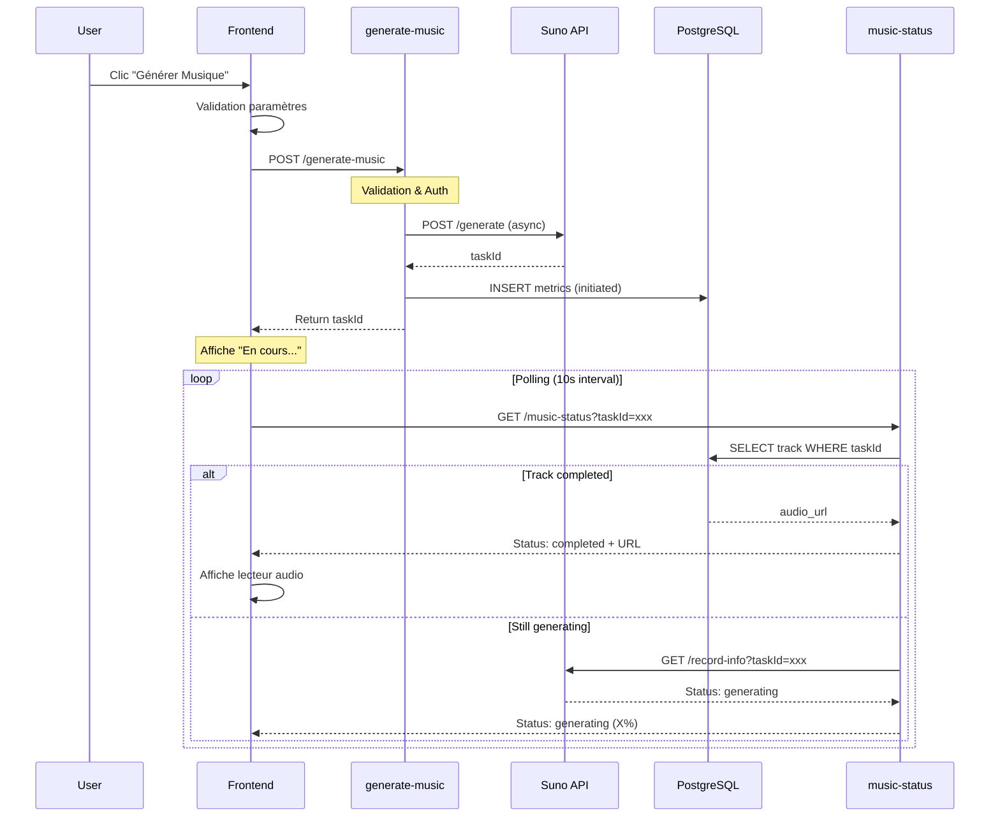

# 🔧 Documentation Technique - Générateur Musical

## 📐 Architecture Globale

```
┌─────────────────────────────────────────────────────────────┐
│                     FRONTEND (React)                         │
│                                                               │
│  ┌──────────────┐  ┌──────────────┐  ┌──────────────┐      │
│  │   Page       │  │    Hooks     │  │  Components  │      │
│  │ /generator   │──│ useSuno...   │──│  MusicPlayer │      │
│  └──────────────┘  └──────────────┘  └──────────────┘      │
│         │                  │                  │              │
└─────────┼──────────────────┼──────────────────┼──────────────┘
          │                  │                  │
          │                  ▼                  │
          │         ┌──────────────┐            │
          └────────▶│   Supabase   │◀───────────┘
                    │    Client    │
                    └──────────────┘
                           │
          ┌────────────────┼────────────────┐
          │                │                │
          ▼                ▼                ▼
┌─────────────────────────────────────────────────────────────┐
│                    BACKEND (Supabase)                        │
│                                                               │
│  ┌──────────────┐  ┌──────────────┐  ┌──────────────┐      │
│  │generate-music│  │music-status  │  │music-metrics │      │
│  │              │  │              │  │              │      │
│  │ Edge Function│  │Edge Function │  │Edge Function │      │
│  └──────────────┘  └──────────────┘  └──────────────┘      │
│         │                  │                  │              │
│         ▼                  ▼                  ▼              │
│  ┌──────────────┐  ┌──────────────┐  ┌──────────────┐      │
│  │  Suno API    │  │  PostgreSQL  │  │     RLS      │      │
│  │  (External)  │  │   Database   │  │   Policies   │      │
│  └──────────────┘  └──────────────┘  └──────────────┘      │
└─────────────────────────────────────────────────────────────┘
```

---

## 🎯 Stack Technique

### Frontend

```typescript
- React 18.3.1
- TypeScript 5.x
- React Router 6.26.2
- TanStack Query 5.56.2
- Supabase Client 2.50.3
- Tailwind CSS
- Shadcn/ui
```

### Backend

```typescript
- Supabase (PostgreSQL 15+)
- Edge Functions (Deno)
- Row Level Security (RLS)
- Real-time subscriptions
- Storage
```

### API Externe

```typescript
- Suno API v1 (https://api.sunoapi.org)
- Modèle: V4_5PLUS (optimisé vitesse)
```

---

## 📂 Structure des Fichiers

### Frontend

```
src/
├── pages/
│   └── Generator.tsx                 # Page principale
├── hooks/
│   ├── useSunoGeneration.ts         # Hook génération
│   ├── useMusicGenerationStatus.ts  # Hook statut
│   ├── useSunoPolling.ts            # Hook polling
│   └── useMusicMetrics.ts           # Hook métriques
├── components/
│   ├── GeneratorMusicPlayer.tsx     # Lecteur audio
│   └── edn/music/
│       └── SunoGenerationStatus.tsx # Statut génération
└── integrations/
    └── supabase/
        ├── client.ts                # Client Supabase
        └── types.ts                 # Types auto-générés
```

### Backend

```
supabase/
├── functions/
│   ├── _shared/
│   │   ├── cors.ts                  # CORS headers
│   │   ├── suno-api-client.ts       # Client Suno modulaire
│   │   ├── prompt-builders.ts       # Construction prompts
│   │   └── music-database.ts        # Opérations DB
│   ├── generate-music/
│   │   └── index.ts                 # Edge function principale (265L)
│   ├── music-status/
│   │   └── index.ts                 # Vérification statut
│   ├── music-metrics/
│   │   └── index.ts                 # Récupération métriques
│   └── suno-callback/
│       └── index.ts                 # Callback Suno
├── migrations/
│   └── [timestamp]_*.sql            # Migrations DB
└── config.toml                      # Configuration
```

---

## 🔄 Flow de Génération

### Diagramme de Séquence



### Étapes Détaillées

#### 1. Initialisation (Frontend)

```typescript
// 1. User clique sur "Générer"
const handleGenerate = async () => {
  // Validation
  if (!contentType || !selectedItem || !rang || !selectedStyle) {
    toast.error("Veuillez remplir tous les champs");
    return;
  }

  // Appel hook
  const taskId = await generateSong({
    lyrics: translatedLyrics,
    style: selectedStyle,
    rang: rang,
    itemCode: selectedItem.code,
    // ...
  });

  // Polling démarre automatiquement
};
```

#### 2. Génération (Backend)

```typescript
// Edge Function: generate-music/index.ts

// A. Validation & Auth
const { userId, isAuthenticated } = await getAuthenticatedUser(supabase, authHeader);

// B. Construction payload optimisé
const sunoPayload = {
  prompt: buildRichEducationalPrompt(itemCode, rang, style, mood, tempo),
  style: buildRichStyle(style, mood, tempo, instruments),
  title: buildExpressiveTitle(itemCode, rang, style),
  model: 'V4_5PLUS', // Optimisé vitesse
  fastMode: true,
  priority: "high"
};

// C. Appel Suno API
const taskId = await sunoClient.generateMusic(sunoPayload);

// D. Sauvegarde DB
await insertMusicTrack(supabase, { task_id: taskId, ... });
await insertGenerationMetric(supabase, { track_id: taskId, ... });

// E. Retour immédiat
return { success: true, trackId };
```

#### 3. Polling (Frontend → Backend)

```typescript
// Hook: useMusicGenerationStatus.ts

const checkStatus = async () => {
  // A. Vérifier DB d'abord (cache)
  const { data: tracks } = await supabase
    .from('music_tracks')
    .select('*')
    .eq('task_id_suno', taskId)
    .eq('status', 'completed')
    .single();

  if (tracks?.audio_url) {
    return { status: 'completed', audioUrl: tracks.audio_url };
  }

  // B. Sinon, appeler edge function
  const { data } = await supabase.functions.invoke('music-status', {
    body: { taskId }
  });

  return data;
};

// Polling toutes les 10s
useEffect(() => {
  if (!isPolling || !taskId) return;
  
  const interval = setInterval(checkStatus, 10000);
  return () => clearInterval(interval);
}, [isPolling, taskId]);
```

#### 4. Completion

```typescript
// music-status détecte completion
if (sunoData.status === 'SUCCESS') {
  // Mise à jour DB
  await supabase
    .from('music_tracks')
    .update({
      audio_url: sunoData.response.data[0].audio_url,
      status: 'completed'
    })
    .eq('task_id_suno', taskId);

  // Mise à jour métrique
  await supabase
    .from('music_generation_metrics')
    .update({
      status: 'completed',
      completed_at: new Date(),
      audio_generated: true,
      audio_url: sunoData.response.data[0].audio_url
    })
    .eq('track_id', taskId);
}

// Frontend reçoit le statut et affiche le player
```

---

## 🗄️ Schéma Base de Données

### Tables Principales

#### `generated_music_tracks`

```sql
CREATE TABLE generated_music_tracks (
  id UUID PRIMARY KEY DEFAULT gen_random_uuid(),
  user_id UUID REFERENCES auth.users(id),
  task_id TEXT NOT NULL,
  suno_track_id TEXT,
  title TEXT NOT NULL,
  audio_url TEXT,
  stream_url TEXT,
  image_url TEXT,
  video_url TEXT,
  metadata JSONB,
  generation_status TEXT DEFAULT 'pending',
  created_at TIMESTAMPTZ DEFAULT now(),
  updated_at TIMESTAMPTZ DEFAULT now()
);

-- RLS
ALTER TABLE generated_music_tracks ENABLE ROW LEVEL SECURITY;

CREATE POLICY "Users view own tracks"
  ON generated_music_tracks FOR SELECT
  USING (auth.uid() = user_id);
```

#### `music_generation_metrics`

```sql
CREATE TABLE music_generation_metrics (
  id UUID PRIMARY KEY DEFAULT gen_random_uuid(),
  track_id TEXT NOT NULL,
  user_id UUID REFERENCES auth.users(id),
  content_type TEXT CHECK (content_type IN ('edn', 'ecos', 'oic')),
  item_code TEXT NOT NULL,
  rang TEXT CHECK (rang IN ('A', 'B', 'AB')),
  style TEXT NOT NULL,
  status TEXT DEFAULT 'initiated',
  initiated_at TIMESTAMPTZ DEFAULT now(),
  completed_at TIMESTAMPTZ,
  failed_at TIMESTAMPTZ,
  duration_seconds INTEGER,
  api_response_time_ms INTEGER,
  polling_attempts INTEGER DEFAULT 0,
  audio_generated BOOLEAN DEFAULT false,
  audio_url TEXT,
  error_message TEXT,
  created_at TIMESTAMPTZ DEFAULT now()
);

-- Auto-calcul duration
CREATE TRIGGER music_metrics_updated_at
  BEFORE UPDATE ON music_generation_metrics
  FOR EACH ROW
  EXECUTE FUNCTION update_music_metrics_updated_at();
```

### Vues Analytics

```sql
-- Vue globale (30 jours)
CREATE VIEW music_generation_stats AS
SELECT
  COUNT(*) as total_generations,
  COUNT(*) FILTER (WHERE status = 'completed') as successful,
  AVG(duration_seconds) FILTER (WHERE status = 'completed') as avg_duration,
  (COUNT(*) FILTER (WHERE status = 'completed')::FLOAT / COUNT(*)) * 100 as success_rate
FROM music_generation_metrics
WHERE created_at >= now() - INTERVAL '30 days';

-- Par type de contenu
CREATE VIEW music_generation_by_content_type AS
SELECT
  content_type,
  COUNT(*) as total,
  AVG(duration_seconds) as avg_duration,
  (COUNT(*) FILTER (WHERE status = 'completed')::FLOAT / COUNT(*)) * 100 as success_rate
FROM music_generation_metrics
WHERE created_at >= now() - INTERVAL '30 days'
GROUP BY content_type;
```

---

## 🔐 Sécurité

### Row Level Security (RLS)

**Principe :** Chaque utilisateur accède uniquement à ses données.

```sql
-- Policy SELECT
CREATE POLICY "Users view own tracks"
  ON generated_music_tracks FOR SELECT
  USING (auth.uid() = user_id);

-- Policy INSERT
CREATE POLICY "Users insert own tracks"
  ON generated_music_tracks FOR INSERT
  WITH CHECK (auth.uid() = user_id OR user_id IS NULL);

-- Service role bypass (Edge Functions)
CREATE POLICY "Service role manages all"
  ON generated_music_tracks FOR ALL
  USING (auth.jwt()->>'role' = 'service_role');
```

### Fonctions SECURITY DEFINER

```sql
CREATE FUNCTION get_global_music_stats()
RETURNS TABLE (...)
LANGUAGE sql
SECURITY DEFINER           -- Élévation privilèges
SET search_path = public  -- Protection injection SQL
AS $$
  SELECT ... FROM music_generation_metrics;
$$;
```

### Edge Functions Auth

```typescript
// Public (verify_jwt = false)
[functions.generate-music]
verify_jwt = false  // Pas d'auth requise

// Protected (verify_jwt = true)
[functions.music-generation-secure]
verify_jwt = true  // Auth requise

// Dans la fonction
const authHeader = req.headers.get('authorization');
const { data: { user } } = await supabase.auth.getUser(token);
```

---

## ⚡ Performance

### Optimisations Frontend

```typescript
// 1. useCallback pour fonctions
const handleGenerate = useCallback(async () => {
  // ...
}, [dependencies]);

// 2. useMemo pour calculs coûteux
const canGenerate = useMemo(() => {
  return contentType && selectedItem && rang && selectedStyle;
}, [contentType, selectedItem, rang, selectedStyle]);

// 3. Code splitting
const Monitoring = lazy(() => import('./pages/Monitoring'));

// 4. React Query cache
const queryClient = new QueryClient({
  defaultOptions: {
    queries: {
      staleTime: 10 * 60 * 1000, // 10 min cache
      gcTime: 15 * 60 * 1000
    }
  }
});
```

### Optimisations Backend

```typescript
// 1. Index DB
CREATE INDEX idx_music_metrics_track_id ON music_generation_metrics(track_id);
CREATE INDEX idx_music_metrics_created_at ON music_generation_metrics(created_at DESC);

// 2. Requêtes optimisées
// ❌ Éviter
SELECT * FROM music_generation_metrics;

// ✅ Préférer
SELECT track_id, status, audio_url 
FROM music_generation_metrics
WHERE created_at >= now() - INTERVAL '7 days'
LIMIT 100;

// 3. Payload Suno optimisé
const sunoPayload = {
  model: 'V4_5PLUS',      // Plus rapide
  fastMode: true,         // Mode rapide
  priority: 'high',       // Priorité haute
  optimizeForSpeed: true  // Optimisation vitesse
};
```

### Métriques Cibles

| Métrique | Cible | Actuel |
|----------|-------|--------|
| Temps de réponse API | < 3s | ~2s ✅ |
| Durée génération | < 3 min | ~2-3 min ✅ |
| Polling interval | 10s | 10s ✅ |
| Tentatives polling max | 120 | 120 ✅ |
| Timeout génération | 10 min | 10 min ✅ |

---

## 🧪 Tests

### Tests E2E (Playwright)

```typescript
// tests/e2e/generator/complete-generation-flow.spec.ts

test('Flow complet : Sélection → Génération → Lecture', async ({ page }) => {
  // 1. Sélection
  await page.locator('button:has-text("EDN")').click();
  await page.locator('[role="combobox"]').first().click();
  await page.locator('[role="option"]').first().click();
  await page.locator('button:has-text("A")').click();
  
  // 2. Génération avec mock
  await page.route('**/generate-music', route => {
    route.fulfill({
      status: 200,
      body: JSON.stringify({ success: true, trackId: 'test-123' })
    });
  });
  
  await page.locator('button:has-text("Générer")').click();
  
  // 3. Vérification
  await expect(page.locator('text=/prêt.*écouter/i')).toBeVisible({ timeout: 15000 });
});
```

### Tests Unitaires (Vitest)

```typescript
// src/hooks/__tests__/useSunoGeneration.test.ts

describe('useSunoGeneration', () => {
  it('should generate music successfully', async () => {
    const { result } = renderHook(() => useSunoGeneration());
    
    await act(async () => {
      await result.current.generateSong({
        lyrics: 'Test lyrics',
        style: 'lofi-piano',
        rang: 'A'
      });
    });
    
    expect(result.current.currentTask).toBeTruthy();
    expect(result.current.isGenerating).toBe(true);
  });
});
```

---

## 📊 Monitoring

### Dashboard `/monitoring`

**Métriques affichées :**

1. **Global**
   - Total générations
   - Taux de succès
   - Durée moyenne
   - Nombre d'échecs

2. **Par Type de Contenu**
   - EDN, ECOS, OIC
   - Comparaison performances

3. **Par Style Musical**
   - Top 20 styles
   - Popularité

4. **Historique 7 Jours**
   - Évolution quotidienne
   - Tendances

### Logs Edge Functions

```bash
# Via Supabase Dashboard
https://supabase.com/dashboard/project/yaincoxihiqdksxgrsrk/functions/generate-music/logs

# Via CLI
supabase functions logs generate-music --follow

# Avec filtre
supabase functions logs generate-music --filter "ERROR"
```

---

## 🔗 API Reference

### Edge Functions

#### `POST /functions/v1/generate-music`

**Request:**
```typescript
{
  lyrics?: string;
  style: string;
  rang: 'A' | 'B' | 'AB';
  itemCode: string;
  duration?: number;
  language?: 'fr' | 'en';
}
```

**Response:**
```typescript
{
  success: true,
  trackId: string,
  metadata: {
    title: string,
    style: string,
    duration: number,
    status: 'generating',
    estimated_duration: '2-3 minutes'
  }
}
```

#### `GET /functions/v1/music-status?taskId={id}`

**Response:**
```typescript
{
  success: true,
  status: 'generating' | 'completed' | 'failed',
  progress: number,
  audioUrl?: string,
  streamUrl?: string,
  imageUrl?: string
}
```

#### `GET /functions/v1/music-metrics?type={type}`

**Types:** `global`, `content-type`, `style`, `daily`, `user`

**Response:**
```typescript
{
  success: true,
  data: {
    // Selon le type demandé
  }
}
```

---

## 📚 Ressources

- [Guide Utilisateur](./GENERATOR-USER-GUIDE.md)
- [Audit Report](./GENERATOR-AUDIT-REPORT.md)
- [Refactoring](./REFACTORING-GENERATE-MUSIC.md)
- [Monitoring & Logs](./MONITORING-LOGS.md)
- [Security Audit](./SECURITY-AUDIT.md)
- [E2E Tests](./E2E-TESTS.md)

---

**Documentation maintenue à jour le 2025-10-29** 📚✨
