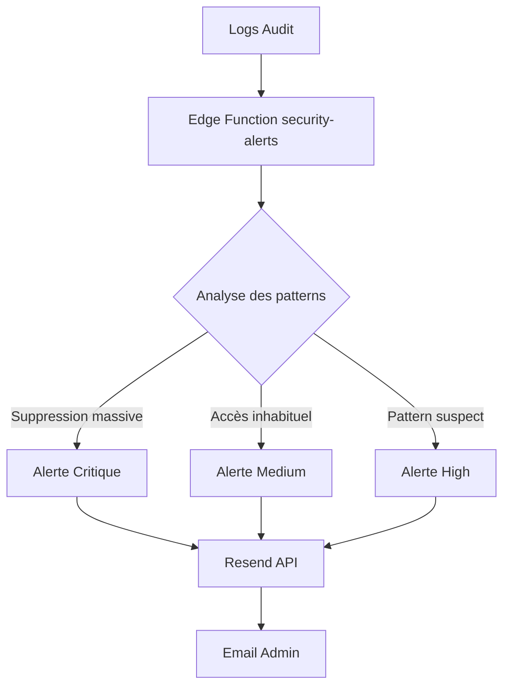

# 🚨 Guide du Système d'Alertes Sécurité

## Vue d'ensemble

Le système d'alertes sécurité surveille automatiquement les activités suspectes dans la base de données et envoie des notifications email aux administrateurs.

## Architecture



## Types d'activités détectées

### 1. Suppressions massives
- **Critère**: Plus de 10 suppressions en 1 heure par un même utilisateur
- **Sévérité**: CRITICAL
- **Action**: Email immédiat avec liste des ressources supprimées

### 2. Pattern d'accès inhabituel
- **Critère**: Accès à plus de 20 ressources différentes en 1 heure
- **Sévérité**: MEDIUM
- **Action**: Email de surveillance avec détails d'activité

### 3. Accès non autorisés
- **Critère**: Tentatives d'accès à des ressources protégées
- **Sévérité**: HIGH
- **Action**: Email d'alerte avec IP et user agent

## Configuration

### Variables d'environnement Supabase

```bash
# Dans Supabase Dashboard > Edge Functions > Secrets
RESEND_API_KEY=re_xxxxxxxxxxxxx
ADMIN_EMAIL=admin@votredomaine.com
```

### Déploiement de l'Edge Function

```bash
# Déployer la fonction d'alertes
supabase functions deploy security-alerts

# Tester la fonction
supabase functions invoke security-alerts
```

### Configuration automatique avec pg_cron

```sql
-- Exécuter la vérification toutes les heures
SELECT cron.schedule(
  'security-alerts-hourly',
  '0 * * * *', -- Chaque heure à 0 minutes
  $$
  SELECT net.http_post(
    url := 'https://yaincoxihiqdksxgrsrk.supabase.co/functions/v1/security-alerts',
    headers := '{"Content-Type": "application/json"}'::jsonb,
    body := '{}'::jsonb
  ) AS request_id;
  $$
);
```

## Page d'administration /audit

### Fonctionnalités

#### 📊 Tableau de bord
- **Statistiques globales**: Total actions, consultations, modifications, suppressions
- **Graphique temporel**: Activité des 14 derniers jours
- **Répartition**: Camembert par type d'action
- **Top utilisateurs**: Classement par activité

#### 📋 Logs détaillés
- **Filtres avancés**:
  - Par type d'action (view, create, update, delete, access)
  - Par type de ressource (sitemap, share, user)
  - Recherche textuelle (utilisateur, IP, ressource)
- **Colonnes affichées**:
  - Date & heure
  - Action (avec badge coloré)
  - Utilisateur
  - Ressource (type + ID)
  - Adresse IP
  - Détails JSON expandables

#### 📥 Export CSV
- **Bouton d'export**: Génère un fichier CSV avec tous les logs filtrés
- **Format**: Compatible Excel/Google Sheets
- **Colonnes**: Date, Action, Utilisateur, Type de ressource, ID, IP, User Agent

## Sécurité et contrôle d'accès

### Rôles autorisés
```typescript
// Dans AuditPage.tsx
const { isAdmin, isSecurityAnalyst } = useUserRoles();

// Redirection si non autorisé
if (!isAdmin && !isSecurityAnalyst) {
  return <Navigate to="/" replace />;
}
```

### RLS Policies
La table `share_audit_logs` a des policies restrictives:
- **Lecture**: Uniquement service_role et utilisateurs avec rôle admin/security_analyst
- **Écriture**: Uniquement via triggers et service_role

## Format des emails d'alerte

```html
🔥 Alerte Sécurité - CRITICAL

Suppression massive détectée: 12 suppressions

Détails de l'activité suspecte:
• Type: mass_deletion
• Utilisateur: user@example.com (uuid)
• Détection: 13/11/2024 14:30:25

Informations détaillées:
{
  "count": 12,
  "resources": [
    { "type": "sitemap", "id": "abc-123" },
    ...
  ]
}

[Voir les logs d'audit]
```

## Tests et validation

### Test manuel de l'Edge Function
```bash
curl -X POST https://yaincoxihiqdksxgrsrk.supabase.co/functions/v1/security-alerts \
  -H "Authorization: Bearer YOUR_ANON_KEY" \
  -H "Content-Type: application/json"
```

### Créer des logs de test
```typescript
// Via useLogAuditEvent
const { logEvent } = useLogAuditEvent();

// Simuler suppressions massives
for (let i = 0; i < 12; i++) {
  await logEvent('delete', 'sitemap', `test-${i}`);
}

// Attendre 1 minute puis vérifier les emails
```

### Vérifier les emails reçus
1. Consulter votre boîte email administrateur
2. Vérifier la présence de l'email d'alerte
3. Cliquer sur "Voir les logs d'audit" → doit rediriger vers /audit

## Monitoring et maintenance

### Logs de l'Edge Function
```bash
# Voir les logs en temps réel
supabase functions logs security-alerts --tail

# Filtrer par erreurs uniquement
supabase functions logs security-alerts --filter error
```

### Métriques disponibles
- Nombre d'alertes envoyées par jour
- Types d'activités suspectes détectées
- Temps de réponse de la fonction
- Taux de succès d'envoi d'emails

## Troubleshooting

### ❌ Les emails ne sont pas envoyés
1. Vérifier que `RESEND_API_KEY` est configuré dans Supabase
2. Vérifier que `ADMIN_EMAIL` est une adresse valide
3. Consulter les logs de la fonction : `supabase functions logs security-alerts`

### ❌ Pas d'alertes malgré des activités suspectes
1. Vérifier que pg_cron est actif : `SELECT * FROM cron.job;`
2. Vérifier les logs d'audit : ils doivent contenir des entrées
3. Tester manuellement la fonction

### ❌ Page /audit vide
1. Vérifier que l'utilisateur a le rôle admin ou security_analyst
2. Vérifier que la table share_audit_logs contient des données
3. Ouvrir la console navigateur pour voir les erreurs

## Bonnes pratiques

1. **Configurer plusieurs emails admin**:
```typescript
to: [ADMIN_EMAIL, 'security@company.com', 'cto@company.com']
```

2. **Ajuster les seuils de détection** selon votre usage:
```typescript
// Dans security-alerts/index.ts
if (deletions.length >= 5) { // Modifier ce seuil
```

3. **Exporter régulièrement les logs** pour analyse externe

4. **Surveiller les faux positifs** et ajuster les règles

## Roadmap

- [ ] Intégration Slack/Discord pour alertes
- [ ] Dashboard temps réel avec websockets
- [ ] ML pour détection d'anomalies
- [ ] Archive automatique logs >90 jours vers S3
- [ ] Rapports hebdomadaires automatiques

---

**📧 Support**: En cas de problème, consulter les logs de l'Edge Function et vérifier la configuration des secrets Supabase.
