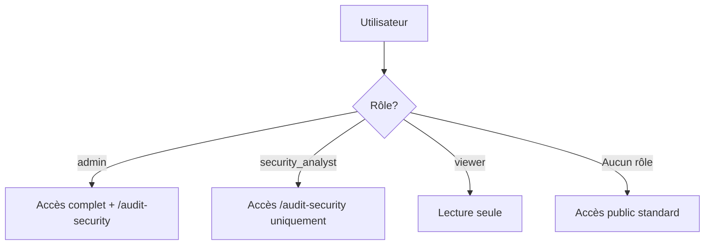

# 🔐 Configuration des Rôles de Sécurité

## Vue d'ensemble

Ce guide explique comment assigner le rôle `security_analyst` à des utilisateurs pour leur donner accès à la page `/audit-security` sans les privilèges admin complets.

## Architecture des rôles



## Rôles disponibles

| Rôle | Accès | Description |
|------|-------|-------------|
| `admin` | Complet | Administration complète + audit |
| `security_analyst` | Audit | Accès page d'audit et logs |
| `viewer` | Lecture | Consultation uniquement |

## Assigner le rôle security_analyst

### Option 1: Via SQL Editor (Recommandé)

1. **Ouvrir le SQL Editor dans Supabase**
   - Aller sur: https://supabase.com/dashboard/project/yaincoxihiqdksxgrsrk/sql/new

2. **Exécuter la requête SQL suivante**:

```sql
-- Assigner le rôle security_analyst à un utilisateur
-- Remplacer 'user@example.com' par l'email de l'utilisateur

-- Étape 1: Récupérer l'UUID de l'utilisateur
SELECT id, email 
FROM auth.users 
WHERE email = 'user@example.com';

-- Étape 2: Utiliser l'UUID pour assigner le rôle
INSERT INTO public.user_roles (user_id, role)
VALUES (
  (SELECT id FROM auth.users WHERE email = 'user@example.com'),
  'security_analyst'::app_role
)
ON CONFLICT (user_id, role) DO NOTHING;

-- Vérifier l'assignation
SELECT u.email, ur.role
FROM auth.users u
JOIN public.user_roles ur ON u.id = ur.user_id
WHERE u.email = 'user@example.com';
```

### Option 2: Via Interface Admin (à implémenter)

Créer une page d'administration des rôles dans l'application:

```typescript
// Exemple d'utilisation du hook
import { useUserRoles } from '@/hooks/useUserRoles';

function AdminRoleManager() {
  const { assignRole, removeRole, allUsers } = useUserRoles();

  const handleAssignSecurityAnalyst = (userId: string) => {
    assignRole({ userId, role: 'security_analyst' });
  };

  return (
    <div>
      {allUsers.map(user => (
        <div key={user.id}>
          <span>{user.email}</span>
          <button onClick={() => handleAssignSecurityAnalyst(user.id)}>
            Assigner Security Analyst
          </button>
        </div>
      ))}
    </div>
  );
}
```

## Assigner plusieurs utilisateurs à la fois

```sql
-- Assigner le rôle à plusieurs utilisateurs d'un coup
INSERT INTO public.user_roles (user_id, role)
SELECT id, 'security_analyst'::app_role
FROM auth.users
WHERE email IN (
  'analyst1@example.com',
  'analyst2@example.com',
  'analyst3@example.com'
)
ON CONFLICT (user_id, role) DO NOTHING;
```

## Retirer le rôle security_analyst

```sql
-- Retirer le rôle d'un utilisateur
DELETE FROM public.user_roles
WHERE user_id = (SELECT id FROM auth.users WHERE email = 'user@example.com')
  AND role = 'security_analyst';
```

## Lister tous les security_analysts

```sql
-- Voir tous les utilisateurs avec le rôle security_analyst
SELECT 
  u.email,
  u.created_at as user_created_at,
  ur.assigned_at as role_assigned_at,
  ur.assigned_by
FROM auth.users u
JOIN public.user_roles ur ON u.id = ur.user_id
WHERE ur.role = 'security_analyst'
ORDER BY ur.assigned_at DESC;
```

## Permissions du rôle security_analyst

### ✅ Accès autorisés
- **Page /audit-security**: Consultation complète
- **Dashboard d'audit**: Statistiques et graphiques
- **Logs d'audit**: Visualisation et filtrage
- **Export CSV**: Téléchargement des logs
- **Alertes de sécurité**: Visualisation des notifications

### ❌ Accès refusés
- **Pages d'administration**: Gestion des utilisateurs, configuration système
- **Modification des données**: Création/suppression de ressources
- **Gestion des rôles**: Attribution/retrait de rôles à d'autres utilisateurs
- **Configuration**: Paramètres système et intégrations

## Contrôle d'accès dans le code

Le contrôle d'accès est automatiquement géré par:

```typescript
// Dans AuditPage.tsx
const { isAdmin, isSecurityAnalyst } = useUserRoles();

// Redirection automatique si non autorisé
if (!isAdmin && !isSecurityAnalyst) {
  return <Navigate to="/" replace />;
}
```

## RLS Policies

Les policies Supabase garantissent que:

```sql
-- Lecture des logs d'audit
-- Uniquement pour admin et security_analyst
CREATE POLICY "Security analysts can view audit logs"
ON share_audit_logs
FOR SELECT
TO authenticated
USING (
  EXISTS (
    SELECT 1 FROM user_roles
    WHERE user_id = auth.uid()
    AND role IN ('admin', 'security_analyst')
  )
);
```

## Tests de validation

### Vérifier l'accès après assignation

1. **Se connecter avec le compte utilisateur**
2. **Naviguer vers** `/audit-security`
3. **Vérifier**:
   - ✅ Page accessible (pas de redirection)
   - ✅ Statistiques affichées
   - ✅ Logs visibles
   - ✅ Bouton Export CSV fonctionnel

### Tests de sécurité

```typescript
// Test unitaire du contrôle d'accès
describe('Security Analyst Access', () => {
  test('security_analyst can access /audit-security', async () => {
    // Mock user with security_analyst role
    const { result } = renderHook(() => useUserRoles());
    expect(result.current.isSecurityAnalyst).toBe(true);
  });

  test('user without role cannot access /audit-security', async () => {
    // Mock user without roles
    const { result } = renderHook(() => useUserRoles());
    expect(result.current.isSecurityAnalyst).toBe(false);
  });
});
```

## Bonnes pratiques

### 1. Principe du moindre privilège
- N'assignez le rôle qu'aux personnes qui en ont réellement besoin
- Préférez `security_analyst` à `admin` pour les analystes

### 2. Rotation régulière
```sql
-- Révision trimestrielle des rôles
SELECT 
  u.email,
  ur.role,
  ur.assigned_at,
  CURRENT_DATE - DATE(ur.assigned_at) as days_since_assigned
FROM auth.users u
JOIN public.user_roles ur ON u.id = ur.user_id
WHERE ur.role = 'security_analyst'
  AND CURRENT_DATE - DATE(ur.assigned_at) > 90
ORDER BY days_since_assigned DESC;
```

### 3. Audit des assignations
```sql
-- Qui a assigné quels rôles?
SELECT 
  u_assigned.email as assigned_by_email,
  u_target.email as target_user_email,
  ur.role,
  ur.assigned_at
FROM user_roles ur
JOIN auth.users u_target ON ur.user_id = u_target.id
LEFT JOIN auth.users u_assigned ON ur.assigned_by = u_assigned.id
WHERE ur.role = 'security_analyst'
ORDER BY ur.assigned_at DESC;
```

## Troubleshooting

### ❌ Utilisateur ne peut pas accéder à /audit-security

1. **Vérifier le rôle assigné**:
```sql
SELECT role FROM user_roles WHERE user_id = 'USER_UUID';
```

2. **Vérifier la session**:
```typescript
const { data: { user } } = await supabase.auth.getUser();
console.log('User ID:', user?.id);
```

3. **Vérifier les RLS policies**:
```sql
SELECT * FROM pg_policies WHERE tablename = 'share_audit_logs';
```

### ❌ Erreur "role app_role does not exist"

Le type enum n'existe pas, créer avec:
```sql
CREATE TYPE public.app_role AS ENUM ('admin', 'security_analyst', 'viewer');
```

### ❌ Erreur de contrainte unique

L'utilisateur a déjà le rôle:
```sql
-- Vérifier les rôles existants
SELECT * FROM user_roles WHERE user_id = 'USER_UUID';
```

## Scripts utiles

### Script d'initialisation pour une nouvelle équipe

```sql
-- Assigner des rôles à toute une équipe
DO $$
DECLARE
  security_team TEXT[] := ARRAY[
    'alice@company.com',
    'bob@company.com',
    'charlie@company.com'
  ];
  email TEXT;
BEGIN
  FOREACH email IN ARRAY security_team
  LOOP
    INSERT INTO public.user_roles (user_id, role)
    SELECT id, 'security_analyst'::app_role
    FROM auth.users
    WHERE auth.users.email = email
    ON CONFLICT (user_id, role) DO NOTHING;
  END LOOP;
END $$;
```

### Rapport d'audit des accès

```sql
-- Générer un rapport complet
SELECT 
  u.email,
  STRING_AGG(ur.role::text, ', ') as roles,
  COUNT(DISTINCT sal.id) as audit_logs_viewed,
  MAX(sal.created_at) as last_activity
FROM auth.users u
LEFT JOIN user_roles ur ON u.id = ur.user_id
LEFT JOIN share_audit_logs sal ON u.id = sal.user_id
WHERE ur.role IN ('admin', 'security_analyst')
GROUP BY u.id, u.email
ORDER BY last_activity DESC NULLS LAST;
```

---

**📧 Support**: Pour toute question sur l'assignation des rôles, contacter l'administrateur système.
