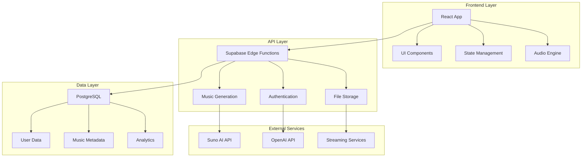

# 🏗️ Architecture Overview - Med Music Platform

## 📊 System Architecture



## 🎯 Core Principles

### 1. **Modular Architecture**
- Monorepo with clear package boundaries
- Shared components and utilities
- Independent deployable units

### 2. **Security First**
- Row Level Security (RLS) for all data access
- JWT-based authentication
- API rate limiting and CORS protection
- Secure secret management

### 3. **Performance Optimized**
- Code splitting and lazy loading
- Optimized bundle sizes
- CDN for static assets
- Database query optimization

### 4. **Scalable Design**
- Serverless architecture with Supabase
- Edge functions for API logic
- Horizontal scaling capabilities
- Caching strategies

## 📦 Package Structure

### Core Packages

#### `@med-music/core`
**Purpose**: Business logic and core functionality
- Music generation services
- Audio processing utilities
- Data validation and transformation
- API client abstractions

#### `@med-music/types`
**Purpose**: Shared TypeScript definitions
- Interface definitions
- Type guards and validators
- API response schemas
- Database entity types

#### `@med-music/ui`
**Purpose**: Reusable UI components
- Design system components
- Custom hooks for UI logic
- Styling utilities
- Animation components

#### `@med-music/config`
**Purpose**: Configuration management
- Environment variables
- Feature flags
- Styling configurations
- Build configurations

## 🏢 Application Architecture

### Frontend (`apps/web`)

```typescript
src/
├── components/           # React components
│   ├── ui/              # Basic UI components
│   ├── features/        # Feature-specific components
│   └── layouts/         # Layout components
├── pages/               # Page components
├── hooks/               # Custom React hooks
├── contexts/            # React contexts
├── services/            # API services
├── utils/               # Utility functions
└── styles/              # Styling files
```

### Backend (Supabase Edge Functions)

```typescript
supabase/functions/
├── generate-music/      # Music generation API
├── music-status/        # Generation status API
├── secure-stream/       # Secure audio streaming
├── user-management/     # User operations
└── shared/              # Shared utilities
```

## 🔐 Security Architecture

### Authentication Flow
1. User registers/login via Supabase Auth
2. JWT token issued with user claims
3. Token validated on each API request
4. RLS policies enforce data access rules

### Data Protection
- **Encryption at rest**: All sensitive data encrypted
- **Encryption in transit**: HTTPS/WSS for all communications
- **Access control**: Fine-grained permissions via RLS
- **Audit logging**: All user actions logged

### API Security
- **Rate limiting**: Prevent abuse and DDoS
- **CORS**: Strict origin validation
- **Input validation**: All inputs sanitized and validated
- **Secret management**: Environment variables for sensitive data

## 📊 Data Architecture

### Database Schema

```sql
-- Users and Authentication
profiles
user_quotas
user_activity_logs

-- Music Generation
generated_music_tracks
user_generated_music
music_generation_queue

-- Content Management
edn_items_complete
oic_competences
content_master

-- System
rate_limit_counters
performance_metrics
```

### Data Flow
1. **User Input** → Validation → Business Logic
2. **Business Logic** → Edge Functions → External APIs
3. **External APIs** → Processing → Database Storage
4. **Database** → Query → Cache → Frontend

## 🚀 Deployment Architecture

### Development Environment
- Local Supabase instance
- Hot reloading for all packages
- Mock external services
- Comprehensive testing suite

### Staging Environment
- Production-like setup
- Real external API integration
- Performance monitoring
- Security scanning

### Production Environment
- Multi-region deployment
- Auto-scaling edge functions
- CDN for static assets
- Real-time monitoring

## 📈 Monitoring & Observability

### Metrics Collection
- **Performance**: Response times, throughput
- **Errors**: Error rates, exception tracking
- **Usage**: Feature adoption, user behavior
- **Business**: Conversion rates, revenue

### Logging Strategy
- **Structured logging**: JSON format with correlation IDs
- **Log levels**: Debug, info, warn, error
- **Retention**: 30 days production, 7 days staging
- **Alerting**: Critical errors trigger notifications

### Health Checks
- **Application health**: API endpoint availability
- **Database health**: Connection and query performance
- **External services**: Third-party API status
- **Infrastructure**: Server resources and network

## 🔧 Development Workflow

### Local Development
```bash
# Install dependencies
npm install

# Start development servers
npm run dev

# Run tests
npm run test

# Build for production
npm run build
```

### Testing Strategy
- **Unit tests**: Individual functions and components
- **Integration tests**: API endpoints and database operations
- **E2E tests**: Complete user workflows
- **Security tests**: Authentication and authorization
- **Performance tests**: Load and stress testing

### Deployment Pipeline
1. **Code commit** → Automated tests
2. **Tests pass** → Build artifacts
3. **Build success** → Deploy to staging
4. **Staging validation** → Deploy to production
5. **Production deployment** → Health checks
6. **Health checks pass** → Notify team

## 🎛️ Configuration Management

### Environment Variables
```typescript
// Development
VITE_SUPABASE_URL=http://localhost:54321
VITE_SUPABASE_ANON_KEY=local-key

// Production
VITE_SUPABASE_URL=https://project.supabase.co
VITE_SUPABASE_ANON_KEY=production-key
```

### Feature Flags
- **New features**: Gradual rollout to users
- **Experiments**: A/B testing capabilities
- **Emergency**: Quick feature disable/enable
- **Environment-specific**: Different features per environment

This architecture ensures scalability, maintainability, and security while providing a great developer experience and user performance.