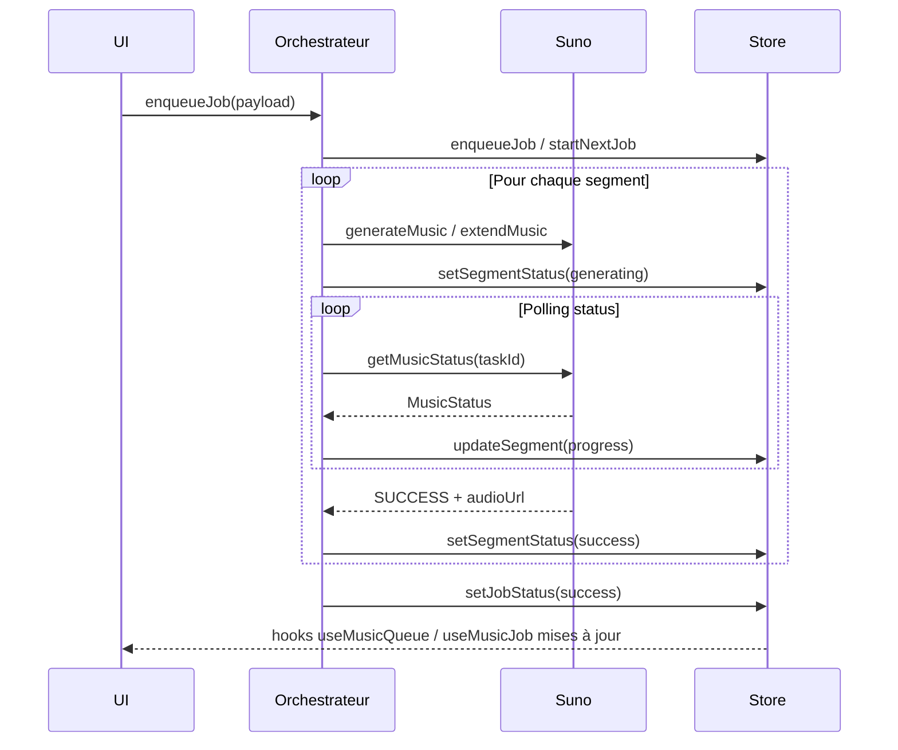

# Orchestrateur de génération musicale

Ce document résume le fonctionnement du nouvel orchestrateur côté front. Il détaille les contrats exposés, les états possibles et le déroulé de la séquence multi-segments.

## Contrats clés

### `musicOrchestrator.enqueueJob(options)`
- `payload` : [`GenerateMusicPayload`](../src/music/generate.ts) original transmis à l'Edge Function Supabase.
- `targetDuration` : durée totale visée en secondes (défaut 180s).
- `segmentDuration` : durée d'un segment individuel (défaut 60s). L'orchestrateur force un découpage en 3 à 5 segments avec ajustement automatique de la durée cible.
- `metadata` : dictionnaire libre pour corréler un job à l'UI (item_code, requestId, etc.).
- `maxRetries` : nombre maximum de relances automatiques (défaut 3).

La méthode retourne l'objet [`MusicJob`](../src/types/music.ts) persisté dans le store `musicQueueStore`.

### Hooks dédiés
- `useMusicQueue()` : retourne la file d'attente ordonnée, le job actif et le dernier job terminé.
- `useMusicJob(jobId)` : expose l'état détaillé d'un job (progression, segment courant, ETA, possibilités d'annulation ou de retry).

### Store `musicQueueStore`
Le store Zustand persiste dans `localStorage` les jobs, la queue et le dernier job actif. Les actions principales :
- `enqueueJob`, `requeueJob`, `startNextJob`
- `setJobStatus`, `setSegmentStatus`, `updateJob`, `updateSegment`
- `cancelJob`, `clearCompletedJobs`

## États possibles

| Type | États |
| --- | --- |
| Job | `queued`, `running`, `success`, `failed`, `canceled`, `paused` |
| Segment | `pending`, `generating`, `success`, `failed`, `canceled` |
| Statut Suno | `PENDING`, `TEXT_SUCCESS`, `FIRST_SUCCESS`, `SUCCESS`, `CREATE_TASK_FAILED`, `GENERATE_AUDIO_FAILED`, `CALLBACK_EXCEPTION`, `SENSITIVE_WORD_ERROR` |

Le statut Suno est converti en progression (5 / 25 / 70 / 100 %) pour fluidifier la barre d'avancement.

## Séquence multi-segments

## Reprise après crash
- Les jobs sont persistés dans `localStorage`.
- Au chargement, l'orchestrateur `resumePendingJobs()` et remet dans la queue les jobs `running`, `queued` ou `paused`.
- Les segments déjà terminés sont ignorés pour éviter de relancer des générations inutiles.

## Gestion des erreurs
- Chaque segment est relancé jusqu'à `maxRetries` avec re-queue automatique et backoff exponentiel (5s → 10s → 20s, plafonné à 60s) pour respecter les limites de rate-limiting.
- Après dépassement, le job passe en `failed` et l'UI peut appeler `musicOrchestrator.retryJob(jobId)`.
- `musicOrchestrator.cancelJob(jobId)` annule le job en cours (statut `canceled` + segments stoppés).
- Les événements sont loggés avec `requestId` pour faciliter le suivi dans la console et les outils d'observabilité.

## Post-traitement audio intégré
- Une fois tous les segments générés, l'orchestrateur assemble le mix final côté navigateur via `OfflineAudioContext`.
- Les segments sont enchaînés avec un crossfade de 2,5s (limité par la durée de chaque segment) afin d'assurer une transition fluide.
- Un gain automatique ajuste la loudness vers -14 LUFS tout en évitant la saturation. Les métadonnées `loudnessNormalization` exposent la correction appliquée et le niveau mesuré.
- Le résultat est fourni sous forme de blob `audio/wav` (`finalMixUrl`) prêt à être téléchargé ou sauvegardé côté Supabase.
